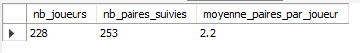
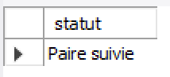
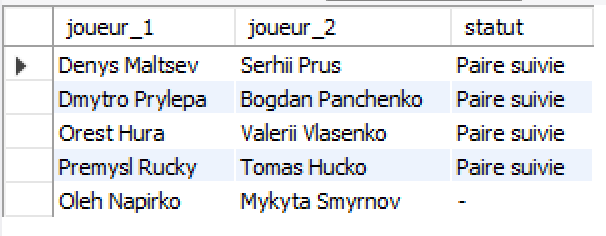
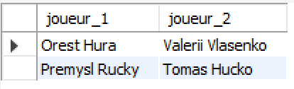
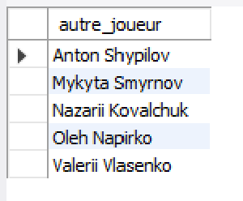
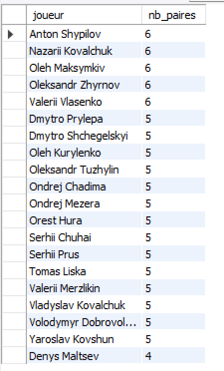
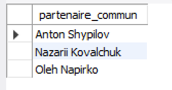
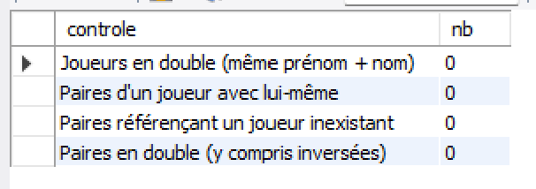

# <p align="center">Tournament Tracker : Repérage de paires de joueurs en tennis de table</p>

**Outils utilisés :** MySQL 8, SQL (DDL, contraintes, vues, CTE, jointures, agrégations)

[Schéma de la base (schema.sql)](https://github.com/AudreyTravant/tournament-tracker-sql/blob/main/schema.sql)

[Données (seed_data.sql)](https://github.com/AudreyTravant/tournament-tracker-sql/blob/main/seed_data.sql)

[Analyse SQL (code)](https://github.com/AudreyTravant/tournament-tracker-sql/blob/main/queries.sql)

---

- **Le problème :** un ami suit des tournois de tennis de table et reçoit régulièrement, depuis une application mobile, la liste des confrontations à venir. Seules certaines paires de joueurs l'intéressent : celles qu'il a repérées au fil du temps, aujourd'hui au nombre de 253, réparties sur 228 joueurs majoritairement ukrainiens, tchèques et slovaques. Il devait parcourir chaque nouvelle liste à la main pour vérifier si l'une de ses paires y figurait : long, répétitif, et il en manquait. La difficulté est aggravée par un détail : une paire s'écrit indifféremment dans un sens ou dans l'autre, et les prénoms se répètent beaucoup (15 joueurs s'appellent « Oleksandr », 15 « Serhii », 11 « Oleh »). Une comparaison naïve rate donc une partie des correspondances tout en risquant d'en inventer d'autres.

- **Comment j'ai résolu le problème :** j'ai conçu une base MySQL volontairement minimale : deux tables, `players` et `tracked_pairs` : qui stocke les paires de référence. L'utilisateur colle la liste des matchs à venir dans une requête, et celle-ci lui indique lesquels correspondent. Le cœur du travail porte sur la fiabilité de la comparaison : une vue `v_pairs` range systématiquement les deux noms par ordre alphabétique, de sorte qu'une paire n'a plus qu'une seule écriture possible des deux côtés de la comparaison ; une colonne générée `pair_key` applique le même principe à la saisie et une contrainte `UNIQUE` refuse une paire déjà enregistrée, même saisie à l'envers ; enfin l'unicité des joueurs porte sur le couple prénom + nom, ce qui autorise les prénoms partagés tout en interdisant deux fiches « Oleh Napirko ». Le fichier de données désigne chaque joueur par une sous-requête sur son nom plutôt que par un identifiant en dur, pour qu'un ajout en amont ne décale pas silencieusement les paires.

## Les questions auxquelles je voulais répondre

## 1. Que contient la base ?

```sql
SELECT
    (SELECT COUNT(*) FROM players)       AS nb_joueurs,
    (SELECT COUNT(*) FROM tracked_pairs) AS nb_paires_suivies,
    ROUND((SELECT COUNT(*) FROM tracked_pairs) * 2.0
          / (SELECT COUNT(*) FROM players), 1) AS moyenne_paires_par_joueur;
```

Résultat :



228 joueurs pour 253 paires suivies, soit 2,2 paires par joueur en moyenne. Le facteur 2 au numérateur tient au fait que chaque paire fait intervenir deux joueurs : 253 paires font 506 apparitions à répartir sur 228 joueurs. Un même joueur revient donc dans plusieurs paires, avec des partenaires différents : la base répertorie des confrontations, pas des joueurs.

## 2. Cette paire fait-elle partie des paires suivies ?

```sql
SELECT
    CASE WHEN COUNT(*) > 0 THEN 'Paire suivie' ELSE 'Non suivie' END AS statut
FROM v_pairs
WHERE player_a = LEAST(   'Orest Hura', 'Valerii Vlasenko')
  AND player_b = GREATEST('Orest Hura', 'Valerii Vlasenko');
```

Résultat :



C'est la vérification unitaire. `LEAST` et `GREATEST` s'appliquent des deux côtés de la comparaison : la paire cherchée est normalisée exactement comme celles de la vue, et la recherche aboutit quel que soit l'ordre dans lequel l'utilisateur saisit les deux noms. Le `CASE` sur `COUNT(*)` garantit une ligne de réponse dans tous les cas : une absence de correspondance renverrait sinon un tableau vide, moins lisible qu'un « Non suivie » explicite.

## 3. Parmi une liste de matchs à venir, lesquels m'intéressent ?

C'est la requête principale, celle qui a motivé le projet. Pour l'utiliser, on remplace les lignes de la CTE `a_venir` par la liste du jour ; le reste ne bouge pas.

```sql
WITH a_venir (joueur_1, joueur_2) AS (
              SELECT 'Orest Hura',        'Valerii Vlasenko'   -- ← remplacer
    UNION ALL SELECT 'Oleh Napirko',      'Mykyta Smyrnov'     --    par la liste
    UNION ALL SELECT 'Premysl Rucky',     'Tomas Hucko'        --    du jour
    UNION ALL SELECT 'Denys Maltsev',     'Serhii Prus'
    UNION ALL SELECT 'Dmytro Prylepa',    'Bogdan Panchenko'
)
SELECT
    a.joueur_1,
    a.joueur_2,
    CASE WHEN v.pair_id IS NOT NULL THEN 'Paire suivie' ELSE '-' END AS statut
FROM a_venir a
LEFT JOIN v_pairs v
       ON v.player_a = LEAST(   a.joueur_1, a.joueur_2)
      AND v.player_b = GREATEST(a.joueur_1, a.joueur_2)
ORDER BY (v.pair_id IS NULL), a.joueur_1;
```

Résultat :



Le `LEFT JOIN` conserve toutes les lignes, y compris celles sans correspondance : l'utilisateur voit sa liste entière annotée plutôt qu'une liste filtrée dont il ne saurait pas ce qui a été écarté. Le `ORDER BY (v.pair_id IS NULL)` exploite le fait qu'en MySQL une expression booléenne vaut 0 ou 1 : les correspondances, pour lesquelles la condition est fausse, remontent en tête. Le travail de vérification manuelle disparaît : une seule exécution traite l'ensemble de la liste.

## 4. Et si je ne veux voir que les correspondances ?

```sql
WITH a_venir (joueur_1, joueur_2) AS (
              SELECT 'Orest Hura',     'Valerii Vlasenko'
    UNION ALL SELECT 'Oleh Napirko',   'Mykyta Smyrnov'
    UNION ALL SELECT 'Premysl Rucky',  'Tomas Hucko'
)
SELECT a.joueur_1, a.joueur_2
FROM a_venir a
JOIN v_pairs v
  ON v.player_a = LEAST(   a.joueur_1, a.joueur_2)
 AND v.player_b = GREATEST(a.joueur_1, a.joueur_2);
```

Résultat :



Variante de la précédente, à un mot près : le `JOIN` interne remplace le `LEFT JOIN` et élimine les lignes sans correspondance. Utile quand la liste du jour est longue et que seules quelques paires en ressortent. Les deux versions coexistent parce qu'elles répondent à deux usages réels : vérifier une liste entière, ou aller droit au résultat.

## 5. Avec qui ce joueur est-il apparié ?

```sql
SELECT
    CASE WHEN p1.last_name = 'Hura'
         THEN CONCAT(p2.first_name, ' ', p2.last_name)
         ELSE CONCAT(p1.first_name, ' ', p1.last_name)
    END AS autre_joueur
FROM tracked_pairs tp
JOIN players p1 ON p1.player_id = tp.player1_id
JOIN players p2 ON p2.player_id = tp.player2_id
WHERE p1.last_name = 'Hura' OR p2.last_name = 'Hura'
ORDER BY autre_joueur;
```

Résultat :



Le joueur cherché peut être enregistré en `player1` comme en `player2` : la clause `WHERE` teste donc les deux colonnes, et le `CASE` renvoie l'autre membre de la paire quel que soit le sens de la saisie. Cette requête sert au repérage inverse : non plus « cette paire est-elle suivie ? », mais « qu'est-ce que je suis déjà autour de ce joueur ? ».

## 6. Quels joueurs reviennent le plus souvent ?

```sql
SELECT
    CONCAT(p.first_name, ' ', p.last_name) AS joueur,
    COUNT(*) AS nb_paires
FROM (
    SELECT player1_id AS player_id FROM tracked_pairs
    UNION ALL
    SELECT player2_id FROM tracked_pairs
) AS participations
JOIN players p ON p.player_id = participations.player_id
GROUP BY p.player_id, joueur
ORDER BY nb_paires DESC, joueur
LIMIT 20;
```

Résultat :



Un joueur compte une paire qu'il figure en `player1` ou en `player2` : les deux colonnes sont donc empilées avant le comptage. `UNION ALL` est ici indispensable : `UNION` dédupliquerait les identifiants et ramènerait chaque joueur à une seule participation, ce qui viderait le classement de son sens. Le regroupement porte sur `p.player_id` et non sur le seul nom concaténé, pour que deux homonymes éventuels restent distingués.

C'est ici que la moyenne de 2,2 calculée à la question 1 prend son utilité : elle donne l'échelle à laquelle lire ce classement. Les joueurs de tête qui s'en écartent nettement dessine ainsi les joueurs autour desquels se concentre l'attention.

## 7. Deux joueurs ont-ils des partenaires en commun ?

```sql
WITH partenaires AS (
    SELECT player_a AS joueur, player_b AS partenaire FROM v_pairs
    UNION
    SELECT player_b, player_a FROM v_pairs
)
SELECT a1.partenaire AS partenaire_commun
FROM partenaires a1
JOIN partenaires a2 ON a1.partenaire = a2.partenaire
WHERE a1.joueur = 'Orest Hura'
  AND a2.joueur = 'Valerii Vlasenko'
ORDER BY partenaire_commun;
```

Résultat :



La CTE `partenaires` symétrise la vue : chaque paire y figure dans les deux sens, ce qui permet ensuite de chercher un joueur dans une seule colonne. L'auto-jointure rapproche alors les partenaires du premier joueur de ceux du second, et ne conserve que les noms présents des deux côtés. C'est la requête qui met en évidence les grappes de joueurs se croisant régulièrement.

## 8. La base est-elle saine ?

```sql
SELECT 'Joueurs en double (même prénom + nom)' AS controle,
       COUNT(*) AS nb
FROM (SELECT first_name, last_name FROM players
      GROUP BY first_name, last_name HAVING COUNT(*) > 1) AS t

UNION ALL
SELECT 'Paires d''un joueur avec lui-même',
       COUNT(*) FROM tracked_pairs WHERE player1_id = player2_id

UNION ALL
SELECT 'Paires référençant un joueur inexistant',
       COUNT(*) FROM tracked_pairs tp
       LEFT JOIN players p1 ON p1.player_id = tp.player1_id
       LEFT JOIN players p2 ON p2.player_id = tp.player2_id
       WHERE p1.player_id IS NULL OR p2.player_id IS NULL

UNION ALL
SELECT 'Paires en double (y compris inversées)',
       COUNT(*) FROM (SELECT player_a, player_b FROM v_pairs
                      GROUP BY player_a, player_b HAVING COUNT(*) > 1) AS t2;
```

Résultat :



Les quatre compteurs doivent valoir zéro : et par construction, ils le valent : chacun teste une situation que le schéma interdit déjà. Les doublons de joueurs sont bloqués par `uq_player_name`, les paires en double par `uq_pair`, la paire d'un joueur avec lui-même par `chk_no_self_pair`, et les références vers un joueur inexistant par les clés étrangères. C'est précisément l'intérêt de la requête : elle vérifie que les garde-fous font ce qu'on attend d'eux, et reste utile après un import ou une migration, puisqu'une contrainte protège les écritures futures sans rien dire de ce qui existait avant elle. Ce contrôle prolonge une leçon tirée de la reprise des données : cinq paires ont dû être écartées parce qu'elles référençaient des joueurs absents de la table (Danylo Us, Ivan Kryvyi, Mykola Treshchetka, Oleksandr Kolos, Vadym Komar). La contrainte `NOT NULL` a rejeté le résultat vide de la sous-requête et rendu l'erreur visible au lieu de la laisser passer silencieusement.

## Conclusion

Ce projet part d'un besoin réel et modeste : éviter de relire à la main une liste de matchs à chaque tournoi. La réponse tient dans deux tables, une vue et huit requêtes : et l'essentiel du travail a porté non sur le volume de données, mais sur la fiabilité de la comparaison. Normaliser l'ordre des noms dans `v_pairs` a permis de traiter le fait qu'une paire s'écrit dans les deux sens ; l'unicité composée sur prénom + nom a permis de gérer des prénoms très répétés sans confondre deux joueurs ; la désignation des joueurs par leur nom plutôt que par un identifiant en dur a rendu le fichier de données robuste aux ajouts. Chacune de ces décisions répond à un problème rencontré, pas à une bonne pratique appliquée par principe.

Le modèle est resté volontairement minimal : ni vainqueur, ni score, ni date, puisque la question posée est seulement de savoir si une paire fait partie de celles à repérer. Toute colonne supplémentaire aurait alourdi la saisie sans servir le besoin.

### Limites et suites possibles

- **La saisie reste manuelle.** Les listes de matchs proviennent de captures d'écran d'une application mobile et doivent être retranscrites dans la CTE. Un import depuis un fichier supprimerait cette étape.
- **L'utilisateur final doit passer par un client SQL**, ce qui suppose de savoir s'en servir. Une interface Streamlit rendrait l'outil autonome.
- **Aucun résultat de match n'est stocké**, par choix. Si le besoin évoluait, une table dédiée aux rencontres réelles viendrait s'ajouter, sans remplacer celle-ci.

## Reproduire

```bash
mysql -u <utilisateur> -p < schema.sql
mysql -u <utilisateur> -p < seed_data.sql
```

Puis ouvrir `queries.sql` et exécuter les requêtes une par une. Testé sur MySQL 8.

### Structure du dépôt

```
.
├── README.md
├── schema.sql                          # tables, contraintes, vue
├── seed_data.sql                       # 228 joueurs, 253 paires
├── queries.sql                         # 8 requêtes commentées
└── migrations/
    └── deduplicate_players.sql         # migration historique (documentation)
```

Le script de déduplication documente la correction d'un problème rencontré sur une version antérieure, où le même joueur pouvait exister en double à cause des variantes de translittération depuis l'ukrainien (Oleg / Oleh, Dmitriy / Dmytro). Il n'est plus nécessaire, le schéma actuel empêchant ces doublons, mais il illustre la démarche : réaffecter les clés étrangères avant de supprimer, dans un ordre qui ne viole aucune contrainte.

## Auteure

Audrey Travant : [LinkedIn](https://www.linkedin.com/in/audrey-travant) · [GitHub](https://github.com/AudreyTravant)
